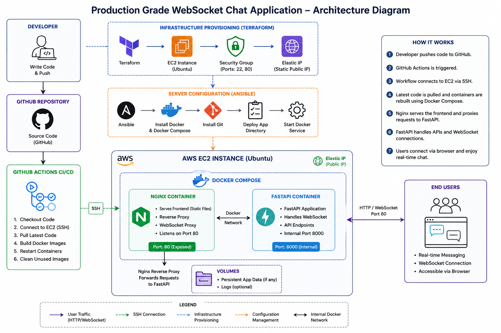
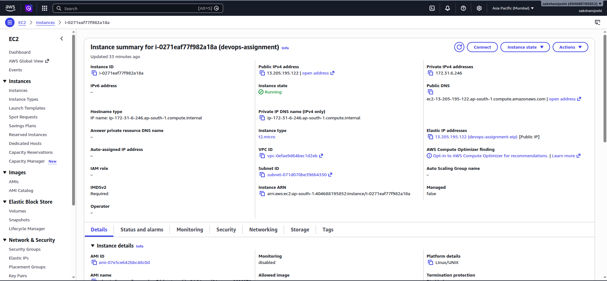
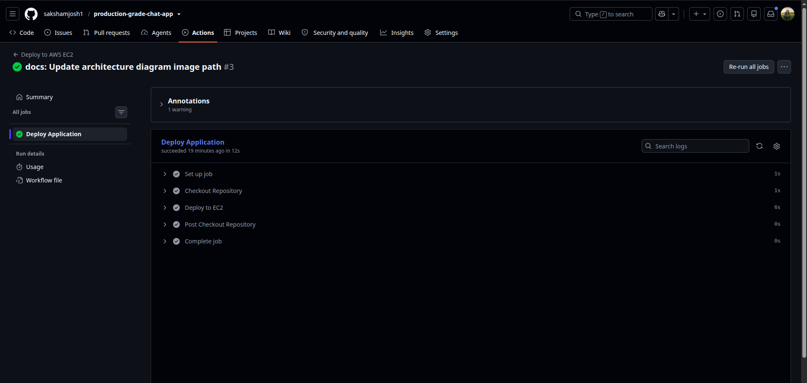
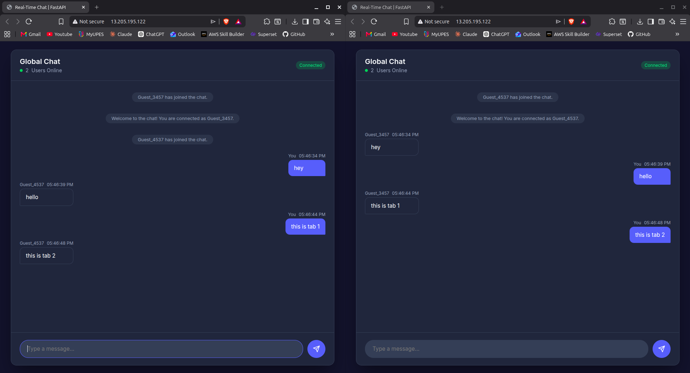

# 🚀 Production Grade WebSocket Chat Application

> 🌐 **Live Demo:** http://13.205.195.122

> 📂 **GitHub Repository:** https://github.com/sakshamjosh1/production-grade-chat-app

---

# Project Overview

This project was completed as part of a **DevOps Engineer Assignment** focused on deploying a production-grade WebSocket chat application.

The objective was to take a deliberately misconfigured application, identify and resolve deployment issues, and successfully deploy it on AWS while following production-oriented DevOps practices.

In addition to completing all mandatory assignment requirements, I also implemented **Infrastructure as Code using Terraform**, **Configuration Management using Ansible**, and an automated **CI/CD pipeline using GitHub Actions** to make deployments fully reproducible.

---

# Assignment Requirements

## Mandatory Requirements

- ✅ Fix Dockerfile
- ✅ Fix Docker Compose configuration
- ✅ Configure Nginx Reverse Proxy
- ✅ Configure WebSocket support
- ✅ Deploy application on AWS EC2
- ✅ Automate deployment using GitHub Actions
- ✅ Create Architecture Diagram
- ✅ Document the complete deployment process
- ✅ Deploy application using a Live Public IP

---

## Bonus Features Implemented

- ✅ Infrastructure as Code (Terraform)
- ✅ Configuration Management (Ansible)

### Future Improvements

- HTTPS using Let's Encrypt
- Monitoring using Grafana / Netdata
- Redis Container
- Load Balancer
- Auto Scaling

---

# Live Deployment

The application is publicly accessible at:

> **http://13.205.195.122**

---

# Architecture Diagram



---

## Request Flow

```
Developer
     │
 git push
     │
     ▼
GitHub Repository
     │
GitHub Actions
     │
SSH
     ▼
AWS EC2
     │
Docker Compose
     │
 ┌───────────────┐
 │               │
 ▼               ▼
Nginx        FastAPI
 │               │
 └────WebSocket──┘
        │
     Browser
```

---

# Tech Stack

## Cloud

- AWS EC2
- Elastic IP

## Infrastructure

- Terraform
- Ansible

## Containerization

- Docker
- Docker Compose

## Reverse Proxy

- Nginx

## Backend

- FastAPI
- Python
- WebSockets

## CI/CD

- GitHub Actions

---

# Docker Container Setup

The application consists of two Docker containers managed by Docker Compose.

## Backend Container

Responsibilities:

- Runs the FastAPI application
- Handles WebSocket connections
- Listens internally on port **8000**

The backend container is **not exposed publicly**.

---

## Nginx Container

Responsibilities:

- Serves the frontend
- Acts as a reverse proxy
- Forwards requests to the backend container
- Handles WebSocket proxying
- Exposes port **80** to the Internet

Only the Nginx container is publicly accessible.

---

# Docker Networking

Docker Compose automatically creates a dedicated bridge network for all services.

```
Internet
    │
    ▼
Nginx Container
    │
Docker Network
    │
    ▼
Backend Container
```

The backend container communicates with Nginx using the Docker service name:

```
backend:8000
```

Since both containers share the same Docker network, no backend ports need to be exposed publicly.

This improves security while allowing seamless communication between containers.

---

# Nginx Reverse Proxy

Nginx serves two primary purposes:

- Serves the frontend application
- Proxies backend requests to FastAPI

Request flow:

```
Browser
    │
HTTP Request
    │
    ▼
Nginx
    │
Reverse Proxy
    │
    ▼
FastAPI
```

Using Nginx as a reverse proxy provides:

- Better security
- Centralized routing
- Static file serving
- WebSocket support
- Easier scalability

---

# WebSocket through Nginx

The application uses WebSockets for real-time communication.

Unlike normal HTTP requests, WebSockets require an HTTP Upgrade handshake.

The Nginx configuration was updated to correctly forward:

- Upgrade headers
- Connection headers
- HTTP/1.1 requests

This allows WebSocket connections to remain persistent between the browser and the backend application.

Request flow:

```
Browser
      │
WebSocket Request
      │
      ▼
Nginx
      │
Upgrade Connection
      │
      ▼
FastAPI WebSocket
```

---

# CI/CD Pipeline

GitHub Actions automatically deploys the latest application whenever changes are pushed to the **master** branch.

Pipeline flow:

```
Developer

git push

↓

GitHub Repository

↓

GitHub Actions

↓

SSH into EC2

↓

git pull

↓

docker compose up -d --build

↓

Application Updated
```

The workflow performs the following steps:

1. Trigger on every push to the master branch
2. Connect to the AWS EC2 instance using SSH
3. Pull the latest source code
4. Rebuild Docker images
5. Restart Docker Compose services
6. Remove unused Docker images

This eliminates manual deployments and ensures the server always runs the latest version of the application.

---

# Issues Found and Fixes

During the assignment, several deployment and infrastructure issues were identified and resolved.

| Issue | Cause | Fix |
|---------|------|-----|
| Docker image build issues | Dockerfile configuration | Updated Dockerfile and build context |
| Docker Compose issues | Incorrect service configuration | Fixed Docker Compose networking and service definitions |
| Backend communication failure | Container networking | Configured Docker networking correctly |
| Nginx routing issues | Incorrect reverse proxy configuration | Updated nginx.conf |
| WebSocket connection failure | Missing Upgrade and Connection headers | Added proper WebSocket proxy configuration |
| Cloud deployment | Manual infrastructure setup | Provisioned AWS EC2 using Terraform |
| Server configuration | Manual package installation | Automated with Ansible |
| Continuous deployment | Manual deployment process | Implemented GitHub Actions CI/CD |
| Stable public endpoint | Dynamic public IP | Configured Elastic IP |

---

# Deployment Steps

## 1. Clone Repository

```bash
git clone https://github.com/sakshamjosh1/production-grade-chat-app.git

cd production-grade-chat-app
```

---

## 2. Provision Infrastructure

```bash
cd infra/terraform

terraform init

terraform apply
```

Terraform provisions:

- EC2 Instance
- Security Group
- Elastic IP

---

## 3. Configure Server

```bash
cd ../ansible

ansible-playbook -i inventory.ini playbook.yml
```

Ansible automatically installs:

- Docker
- Docker Compose
- Git
- Required dependencies

---

## 4. Deploy Application

```bash
docker compose up -d --build
```

The application will be available at:

```
http://13.205.195.122
```

---

# Repository Structure

```
production-grade-chat-app
│
├── .github
│   └── workflows
│       └── deploy.yml
│
├── app
│
├── frontend
│
├── infra
│   ├── terraform
│   └── ansible
│
├── diagrams
│
├── Dockerfile
├── docker-compose.yml
├── nginx.conf
├── README.md
│
└── screenshots
```

---

# Screenshots

## Architecture Diagram


---

## AWS EC2 Instance



---


## GitHub Actions CI/CD



---

## Running Application



---

# Key Learnings

This project provided hands-on experience with:

- Docker containerization
- Docker Compose orchestration
- Docker networking
- Nginx Reverse Proxy
- WebSocket deployment
- AWS EC2 deployment
- Infrastructure as Code using Terraform
- Configuration Management using Ansible
- GitHub Actions CI/CD
- Production deployment workflows
- Infrastructure troubleshooting and debugging

---

# Future Improvements

- Configure HTTPS using Let's Encrypt
- Deploy behind an AWS Application Load Balancer
- Add monitoring using Prometheus and Grafana
- Introduce Redis for session management
- Deploy on Kubernetes
- Implement Auto Scaling Groups

---

# Author

**Saksham Joshi**

DevOps | Cloud | Infrastructure Automation | CI/CD | AWS
